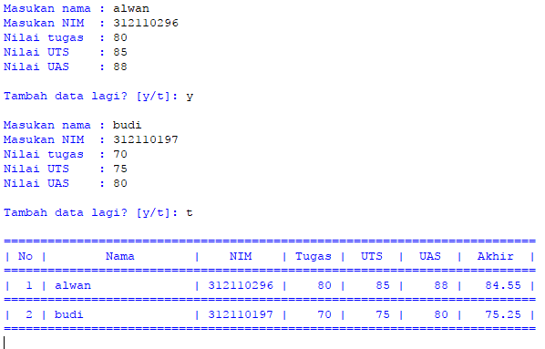

# Labspy4
## Daftar Latihan
## Akses Daftar
-Tampilkan elemen ke 3
-Ambil nilai elemen ke 2sampai elemen ke 4
-Ambil elemen terakhir

## Program

## Penjelasan
1. Membuat daftar nilai yang di inginkan

Makanan = ['Bakso', 'Mie Ayam', 'Seblak', 'Nasi goreng', 'Pecel Lele']

2. Menampilkan semua elemen yang terdapat pada list di atas

print("Makanan :", Makanan)

3. Untuk menampilkan salah satu elemen dalam sebuah daftar dapat menggunakan Makanan[2]

print('Elemen ke-3', Makanan[2])

4. Jika ingin mengambil elemen ke 2 sampai elemen ke 4 dapat menggunakan Makanan[1:5]

print('Elemen ke-2 sampai ke-4', Makanan[1:5])

5. Jika ingin mengambil elemen terakhir dapat menggunakan  Makanan[-1]

print ('Elemen terakhir', Makanan[-1])

## Output

## Mengubah Elemen List
-Ubah elemen ke 4 dengan nilai lainnya
-ubah elemen ke 4 sampai dengan elemen terakhir

## Program

## Penjelasan
1. Membuat list dengan nilai yang di inginkan

Mobil = ['Avanza', 'Terios', 'Rush', 'Ferrari', 'Kijang']

2. Menampilakn semua elemen yang terdapat pada list diatas

Mobil[3] = 'Xenia'
print("Mobil sesudah di ubah:", Mobil)

3. Jika ingin mengubah elemen ke-4 sampai dengan elemen terakhir dapat menggunakan Mobil[3:]

Mobil[3:] = ["Agya", "Ayla"]
print("ubah elemen ke-4 hingga akhir :", Mobil)

## Output

## Menambahkan Elemen List
-Ambil 2 bagian dari list pertama (A) dan jadikan list ke 2 (B)
-Tambah list B dengan nilai string
-Tambah list B dengan 3 nilai
-Gabungkan list B dengan list A

## Program

## Penjelasan
1. Membuat list dengan variabel a dan b

a = [20, 21, 22, 23, 24]
b = [30, 31, 32, 33, 34]

2. Untuk mengambil 2 bagian dari list a dan dijadikan list b

b.append(a[0:2])
print(b)

3. Untuk menambahkan list b dengan nilai string

b.append("59")
print(b)

4. Untuk menambahkan list b dengan 3 nilai

print()
print(b + [40, 41, 42])

5. Untuk menggabungkan list b dengan list a

print(a + b)

## Output

## Tugas Praktikum
## Program sederhana untuk menambahkan data kedalam sebuah list

## Program

## Penjelasan
1. Mendeklarasikan list

_nama = []
_nim = []
_tugas = []
_uts = []
_uas = []
_akhir = []

2. Gunakan perularangan while loop dengan nilai "True"

while True:

3. Menginput nama, nim, tugas, uts, uas, dan akhir dengan menambahkan method .append

 _nama.append(input("Masukan nama : "))
    _nim.append(input("Masukan NIM  : "))
    tugas = int(input("Nilai tugas  : ")); _tugas.append(tugas)
    uts   = int(input("Nilai UTS    : ")); _uts.append(uts)
    uas   = int(input("Nilai UAS    : ")); _uas.append(uas)

    _akhir.append(tugas * 30/100 + uts * 35/100 + uas * 35/100)

4. Pada input Tambah Data Lagi? apabila jawaban “t” atau “T”, maka program akan berhenti dan akan menampilkan hasil daftar datanya

_tanya = input("Tambah data lagi? [y/t]: ")
    print()
    if(_tanya == "t" or _tanya =="T"):
        break

5. Untuk membuat header table, menggunakan print(73*"="), fungsinya membuat "=" sebanyak 73 sebagai garis, dan menggunakan format string

print(73*"=")
print("| {0:^2} | {1:^18} | {2:^9} | {3:^5} | {4:^5} | {5:^5} | {6:^7} |".format("No", "Nama", "NIM", "Tugas", "UTS", "UAS", "Akhir"))
print(73*"=")

6. Deklarasi no = 0 untuk membuat nomor pada isi table, lalu membuat perulangan dengan for

-Perulangan nama, nim, tugas, uts, uas, sesuai urutan yang ada di dalam zip
-Pada list yang dimaksud, in zip berfungsi untuk membungkus semua list

no = 0
for nama, nim, tugas, uts, uas, akhir in zip(_nama, _nim, _tugas, _uts, _uas, _akhir):

7. Membuat isi tabel sesuai keinginan dengan format string

 no += 1    
    print("| {0:>2} | {1:<18} | {2:>9} | {3:>5} | {4:>5} | {5:>5} | {6:>7.2f} |".format(no, nama, nim, tugas, uts, uas, akhir))

8. Untuk membuat footer atau garis paling bawa ketika looping isi table selesai

 print(73*"=")

 ## Output
 

 ## SELESAI